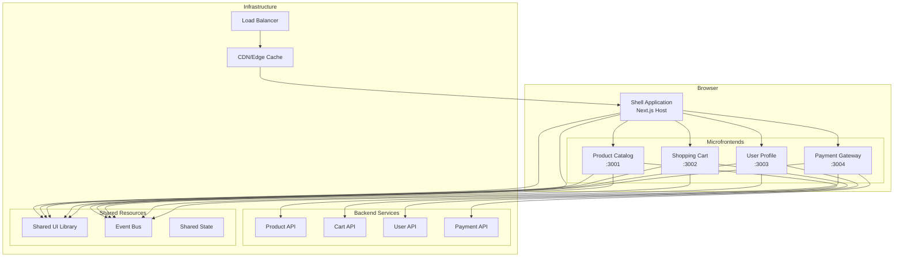
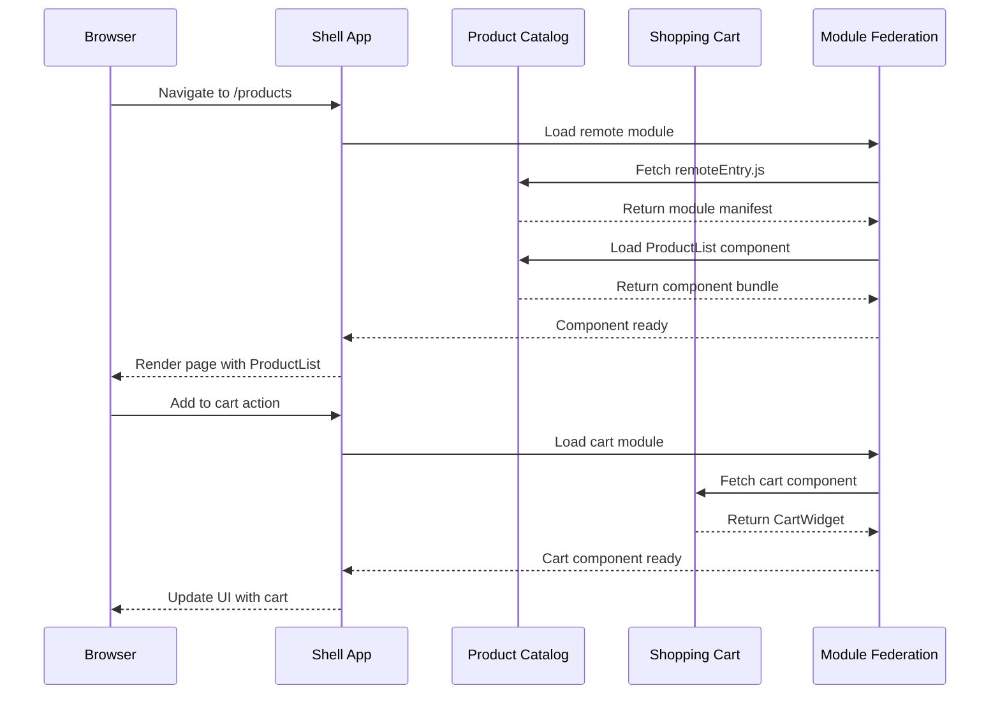
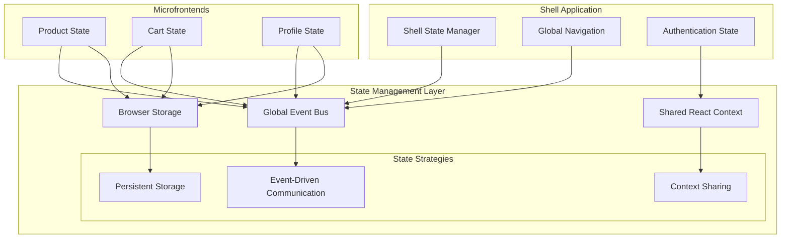
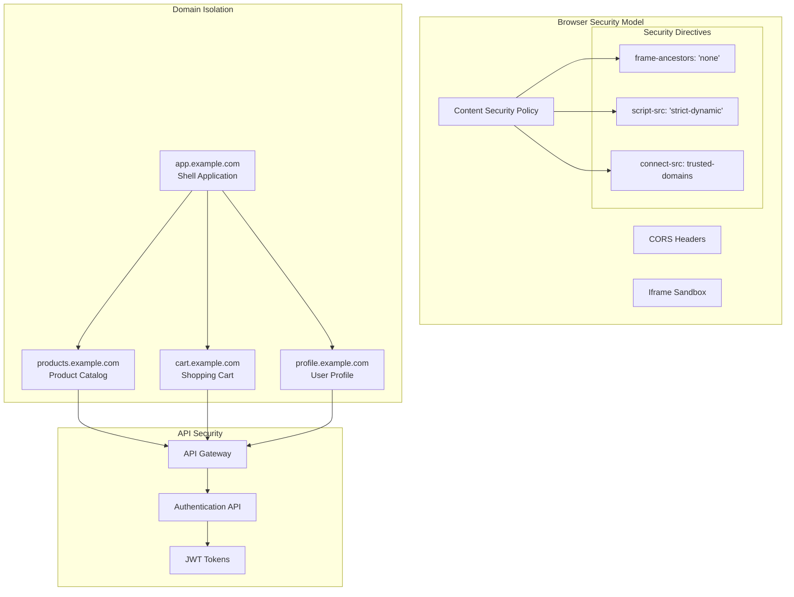
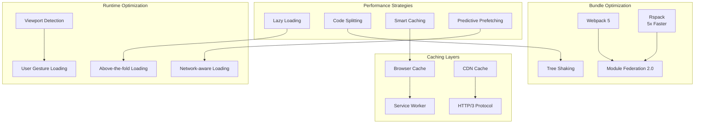
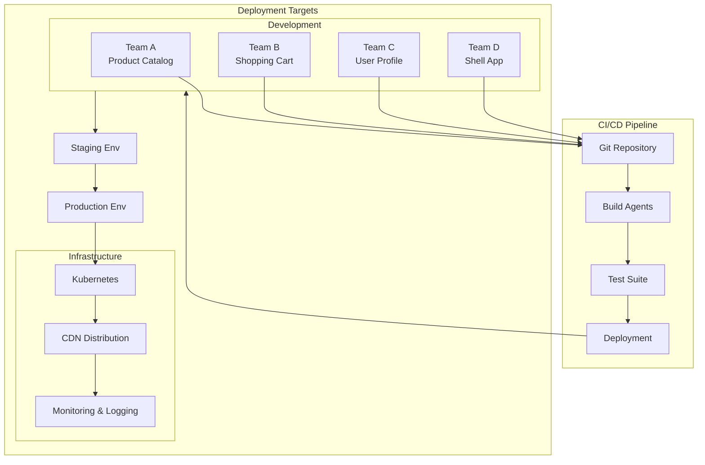
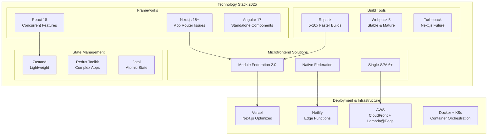
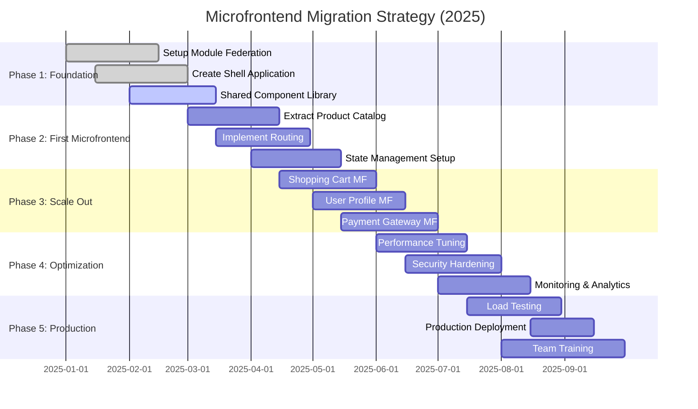

# Microfrontend Architecture Diagrams (2025)

## 🚨 **IMPORTANT: Next.js NOT Recommended**
These diagrams show general microfrontend patterns. **Avoid Next.js + Module Federation** - use Modern.js, Rsbuild, or other alternatives instead.

## 1. Overall Microfrontend Architecture Pattern



## 2. Module Federation 2.0 Runtime Loading



## 3. Next.js Microfrontend Integration Patterns

```mermaid
graph TD
    subgraph "Next.js Host Application"
        Router[Next.js Router]

        subgraph "Pages"
            HomePage[pages/index.js]
            ProductPage[pages/products/[...slug].js]
            CartPage[pages/cart.js]
            ProfilePage[pages/profile.js]
        end

        subgraph "Components"
            Layout[Layout Component]
            Navigation[Navigation]
            ErrorBoundary[Error Boundary]
        end
    end

    subgraph "Remote Microfrontends"
        ProductMF[Product Catalog MF<br/>Exposed: ProductList, ProductDetail]
        CartMF[Shopping Cart MF<br/>Exposed: CartWidget, Checkout]
        ProfileMF[User Profile MF<br/>Exposed: ProfileForm, Settings]
    end

    Router --> HomePage
    Router --> ProductPage
    Router --> CartPage
    Router --> ProfilePage

    ProductPage --> ProductMF
    CartPage --> CartMF
    ProfilePage --> ProfileMF

    Layout --> Navigation
    Layout --> ErrorBoundary

    Navigation --> ProductMF
    Navigation --> CartMF
```

## 4. State Management & Communication Flow



## 5. Security Architecture (CSP, CORS, Sandbox)



## 6. Performance Optimization Flow



## 7. CI/CD & Deployment Pipeline



## 8. Framework Comparison Matrix (2025)

```mermaid
graph TD
    subgraph "Framework Selection Matrix"
        ModuleFed[Module Federation 2.0<br/>✅ Runtime Loading<br/>✅ Framework Agnostic<br/>⚠️ Complex Setup]

        SingleSPA[Single-SPA<br/>✅ Mature Ecosystem<br/>✅ Lifecycle Management<br/>⚠️ Learning Curve]

        Qiankun[Qiankun<br/>✅ Production Ready<br/>✅ 200+ Apps at Ant<br/>⚠️ Chinese Documentation]

        Bit[Bit.dev<br/>✅ Component Sharing<br/>✅ Visual Studio<br/>⚠️ Vendor Lock-in]

        Piral[Piral<br/>✅ Portal Apps<br/>✅ Great DX<br/>⚠️ Specific Use Case]
    end

    subgraph "Use Case Mapping"
        Performance[Performance Critical] --> ModuleFed
        Performance --> Rspack[+ Rspack]

        Enterprise[Enterprise Scale] --> Qiankun
        Enterprise --> SingleSPA

        ComponentSharing[Component Sharing] --> Bit

        PortalApps[Portal Applications] --> Piral

        NextJS[Next.js Integration] --> ModuleFed
        NextJS --> NextJSMF[@module-federation/nextjs-mf]
    end
```

## 9. 2025 Technology Stack Recommendation



## 10. Migration Strategy Timeline



These diagrams provide a comprehensive visual guide to implementing microfrontends with Next.js in 2025, covering architecture patterns, security considerations, performance optimization, and migration strategies.